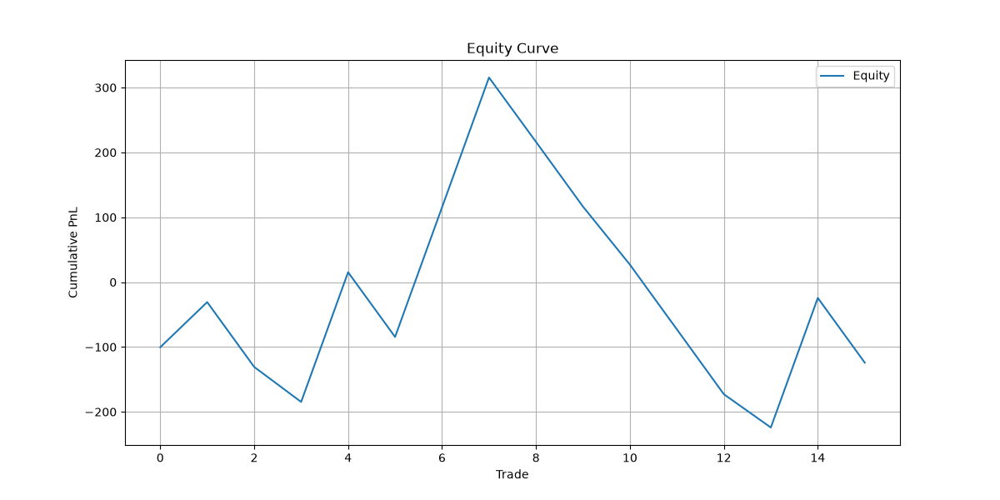
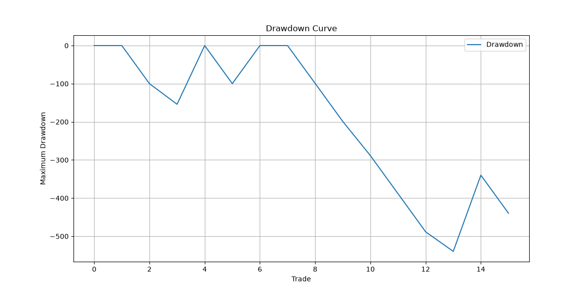
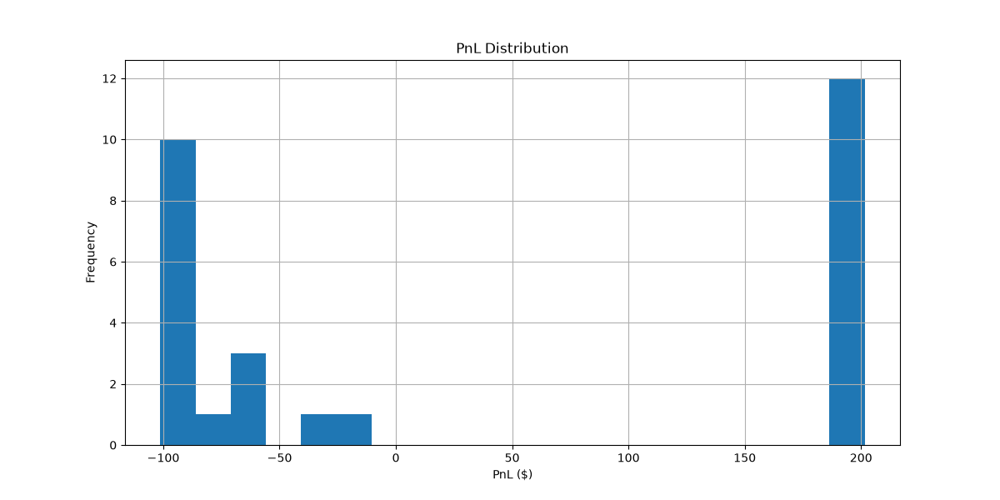
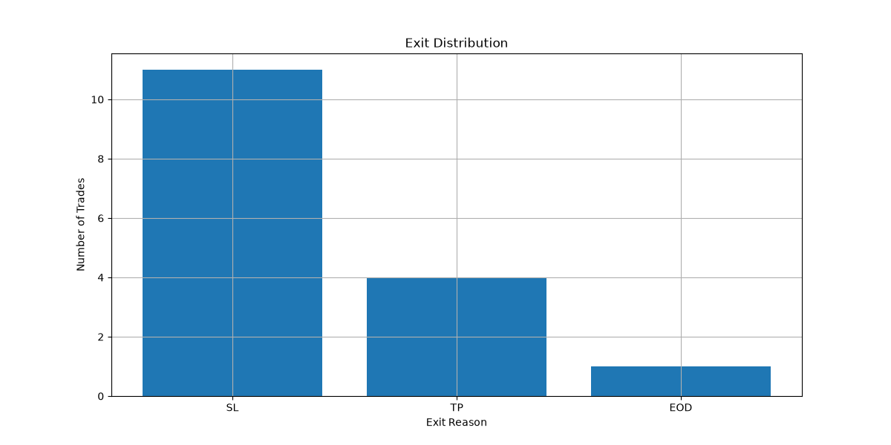
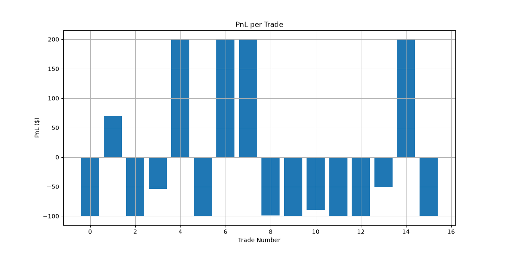

# Python Backtesting Engine

## Description
A pyhton backtesting engine for developing and testing trading strategies on user-provided market data. It is a pipeline that separates loading data (+ preprocessing), introducing indicators, strategy generation, backtesting and statistics. Results are visualised with a separate plotting module. The Main purpose of this project is to improve my python skills while learning quantitative trading and backtesting strategies. The project also includes statistical analysis of strategy performance, including confidence intervals, hypothesis testing, risk-adjusted performance metrics and PnL distribution analysis.

## Project structure

```text
src/
├── data_loader.py
├── indicators.py
├── strategy.py
├── backtester.py
├── performance.py
├── statistics.py
├── distribution.py
├── plots.py
└── main.py
```

```text
experiments/
└── sensitivity_analysis.py
```

```text
notebooks/
└── statistical_derivations.ipynb
```

| File | Description |
|------|-------------|
| `data_loader.py` | Downloads data, source can be chosen by the user. Prepares the data for usage. |
| `indicators.py` | Introduces technical indicators that will be used within the strategy. |
| `strategy.py` | Generates trading signals. |
| `backtester.py` | Uses the generated signals to simulate trades. |
| `performance.py` | Calculates key performance statistics from the list of simulated trades. |
| `statistics.py` | Calculates confidence intervals, hypothesis testing, Sharpe, Sortino, Calmar. |
| `distribution.py` | Calculates distribution parameters. |
| `plots.py` | Visualises the obtained results. |
| `main.py` | Runs complete pipeline |
| `sensitivity_analysis.py` | Sensitivity analysis on RR-parameter |

## Installation
```bash
pip install yfinance pandas numpy matplotlib ta
```

## Pipeline
```python
ticker = "AAPL"

# Load data
data = load_yfinance_data(ticker)
daily = load_daily_data(ticker)

start_date = data.index[0]
end_date = data.index[-1]
days = (end_date - start_date).days

# Indicators
data = get_vwap(data)
data = get_ema(data)
data = get_atr(data, daily)
data = get_dayrange(data)

# Strategy
data = crossover_strategy(data)

# Backtest
trades = backtest(data, risk_reward_ratio=2)

# Statistics
performance_metrics = key_statistics(trades)
winrate = win_rate(trades)
ev = expected_value(trades)
ev_reliability = test_expected_value(trades)
sharpe = Sharpe_ratio(trades)
sortino = Sortino_ratio(trades)
calmar = Calmar_ratio(trades, days)
distribution = distribution_statistics(trades)

print("\n========== BACKTEST RESULTS ==========")

print("\nPERFORMANCE")
print(f"Ticker:              {ticker}")
print(f"Trades:              {performance_metrics['Trades']:.0f}")
print(f"Win rate:            {performance_metrics['Winrate']:.2f}%")
print(f"Profit factor:       {performance_metrics['ProfitFactor']:.2f}")
print(f"Total PnL:           {performance_metrics['TotalPnL']:.2f}")
print(f"Average win:         {performance_metrics['AvgWin']:.2f}")
print(f"Average loss:        {performance_metrics['AvgLoss']:.2f}")
print(f"Max drawdown:        {performance_metrics['MaxDrawdown']:.2f}")
print(f"Return / Drawdown:   {performance_metrics['Return/DD']:.2f}")
print(f"Sharpe Ratio:        {sharpe:.2f}")
print(f"Sortino Ratio:       {sortino:.2f}")
print(f"Calmar Ratio:        {calmar:.2f}")
print(performance_metrics["Exits"])
print(performance_metrics["Percentage exits"])

print("\nCONFIDENCE INTERVALS")
print(f"Observed win rate:   {winrate['WinRate']:.2%}")
print(f"Standard error:      {winrate['StandardError']:.4f}")
print(f"95% CI:              {winrate['LowerCI']:.2%}, {winrate['UpperCI']:.2%}")
print(f"Observed EV:         {ev['ExpectedValue']:.2f}")
print(f"Standard error:      {ev['StandardError']:.4f}")
print(f"95% CI:              {ev['LowerCI']:.2f}, {ev['UpperCI']:.2f}")

print("\nEXPECTED VALUE TEST")
print(f"Observed EV:         {ev_reliability['Observed_EV']:.2f}")
print(f"Null hypothesis EV:  {ev_reliability['Null_hypothesis_EV']:.2f}")
print(f"Standard error:      {ev_reliability['StandardError']:.4f}")
print(f"t-score:             {ev_reliability['t_score']:.3f}")
print(f"p-value:             {ev_reliability['p_value']:.4f}")
print(f"Alpha:               {ev_reliability['alpha']:.2f}")

if ev_reliability["Reject_null"]:
    print("Conclusion:          Reject H0")
else:
    print("Conclusion:          Fail to reject H0")

print("\nDISTRIBUTION")
print(f"Median:              {distribution['Median']:.2f}")
print(f"Best trade:          {distribution['Best']:.2f}")
print(f"Worst trade:         {distribution['Worst']:.2f}")
print(f"Skewness:            {distribution['Skewness']:.2f}")
print(f"Kurtosis:            {distribution['Kurtosis']:.2f}")

# Plots
equity_curve(trades)
drawdown_curve(trades)
pnl_per_trade(trades)
distribution_exits(trades)
plot_pnl_distribution(trades)
```

## Strategy
To test the engine, a simple EMA/VWAP crossover strategy was implemented.

### Entry

- EMA crosses over VWAP --> long
- EMA crosses under VWAP --> short
- Timeframe: 09:40 - 10:30 (NY time)
- Entry on next candle open

### Exit

A position is closed when one of the following occurs:

- Stop-loss is reached
- Take-profit is reached
- End of trading day

### Risk managment

- Initial stop-loss is based on the crossover level.
- A minimum stop distance of `0.05 × ATR_daily` is applied to make sure it's not too tight.
- Take-profit is determined using a fixed risk-reward ratio of 2:1.
- The take-profit must remain within the daily ATR boundary.

## Example output
Engine ran on 21/09/2026 11:30 for ticker "AAPL"

output:
```text
========== BACKTEST RESULTS ==========

PERFORMANCE
Ticker:              AAPL
Trades:              16
Win rate:            31.25%
Profit factor:       0.88
Total PnL:           -124.19
Average win:         173.88
Average loss:        -90.33
Max drawdown:        -539.67
Return / Drawdown:   -0.23
Sharpe Ratio:        -0.05
Sortino Ratio:       -0.09
Calmar Ratio:        -1.97
Reason exit
SL     11
TP      4
EOD     1
Name: count, dtype: int64
Reason exit
SL     68.75
TP     25.00
EOD     6.25
Name: proportion, dtype: float64

CONFIDENCE INTERVALS
Observed win rate:   31.25%
Standard error:      0.1159
95% CI:              8.54%, 53.96%
Observed EV:         -7.76
Standard error:      32.7309
95% CI:              -77.53, 62.00

EXPECTED VALUE TEST
Observed EV:         -7.76
Null hypothesis EV:  0.00
Standard error:      32.7309
t-score:             -0.237
p-value:             0.5921
Alpha:               0.05
Conclusion:          Fail to reject H0

DISTRIBUTION
Median:              -94.41
Best trade:          200.10
Worst trade:         -100.44
Skewness:            1.00
Kurtosis:            -0.96
```
example plots:
### Equity Curve


### Drawdown Curve


### PnL Distribution


### Exit Distribution


### PnL per Trade


## Parameter Sensitivity

The `experiment.py` script is used to investigate how changes in the risk-reward ratio affect strategy performance.

The following metrics are compared across different risk-reward ratios:

- Win rate
- Profit factor
- Total PnL
- Expected value
- Sharpe ratio
- Sortino ratio
- Calmar ratio
- Exit distribution

The analysis is performed across multiple tickers to investigate whether observed results are sensitive to the chosen risk-reward parameter.

### Example output
Engine ran on 21/09/2026 12:08

```tekst
Ticker  RR  Trades  Win rate  Profit factor  Total PnL  Expected value  Sharpe  Sortino  Calmar  SL %  TP %  EOD %
  NVDA 1.0      21      0.57           1.76     518.91           24.71    0.28     0.47   28.66  38.0  57.0    5.0
  NVDA 1.5      21      0.43           1.37     368.67           17.56    0.15     0.28   11.41  52.0  43.0    5.0
  NVDA 2.0      21      0.29           0.94     -81.37           -3.87   -0.02    -0.04   -1.18  67.0  29.0    5.0
  NVDA 2.5      21      0.29           1.07      88.05            4.19    0.03     0.07    1.37  67.0  24.0   10.0
  NVDA 3.0      21      0.24           0.87    -180.63           -8.60   -0.05    -0.10   -2.20  71.0  14.0   14.0
  AAPL 1.0      16      0.50           1.15     105.49            6.59    0.07     0.11    6.20  50.0  50.0    0.0
  AAPL 1.5      16      0.38           0.92     -75.91           -4.74   -0.04    -0.06   -1.92  62.0  31.0    6.0
  AAPL 2.0      16      0.31           0.88    -124.19           -7.76   -0.05    -0.09   -1.97  69.0  25.0    6.0
  AAPL 2.5      16      0.25           0.78    -232.55          -14.53   -0.10    -0.18   -2.78  75.0  19.0    6.0
  AAPL 3.0      16      0.25           0.92     -80.69           -5.04   -0.03    -0.05   -1.04  75.0  19.0    6.0
  MSFT 1.0      28      0.64           2.02     909.01           32.46    0.35     0.61   61.10  36.0  64.0    0.0
  MSFT 1.5      28      0.54           1.99    1120.91           40.03    0.34     0.68   37.01  43.0  54.0    4.0
  MSFT 2.0      28      0.39           1.40     615.33           21.98    0.16     0.32    9.81  57.0  36.0    7.0
  MSFT 2.5      28      0.29           1.04      80.04            2.86    0.03     0.05    0.85  68.0  25.0    7.0
  MSFT 3.0      28      0.21           0.80    -394.16          -14.08   -0.08    -0.16   -2.18  75.0  14.0   11.0
   SPY 1.0      32      0.44           0.90    -148.29           -4.63   -0.04    -0.06   -2.18  56.0  44.0    0.0
   SPY 1.5      32      0.38           1.02      27.33            0.85    0.01     0.02    0.48  62.0  34.0    3.0
   SPY 2.0      32      0.31           1.01      14.79            0.46    0.01     0.02    0.18  69.0  28.0    3.0
   SPY 2.5      32      0.28           1.06     116.53            3.64    0.03     0.06    1.16  72.0  25.0    3.0
   SPY 3.0      32      0.25           1.06     118.57            3.71    0.03     0.06    1.23  75.0  22.0    3.0
```

## Limitations

Current limitations include:

- Limited historical sample
- No transaction costs or slippage
- No out-of-sample or walk-forward validation
- Limited number of traded assets
- Statistical tests rely on assumptions that may not fully hold for financial time series

## Future improvements

- Commission and slippage modelling
- Robustness analysis
- Multiple strategies
- Additional indicators
- News, events and earnings data
- Partial exits
- Trailing stop-loss