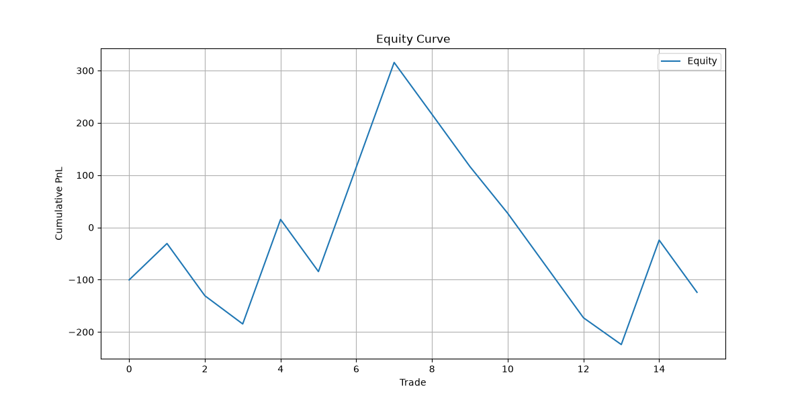
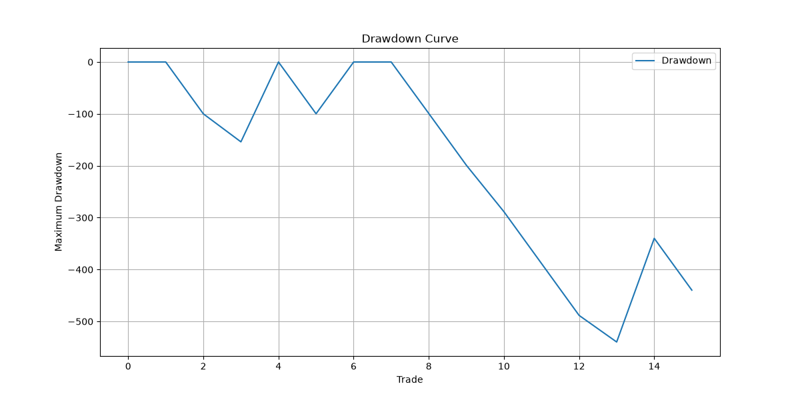
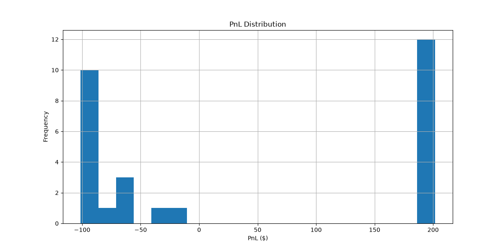
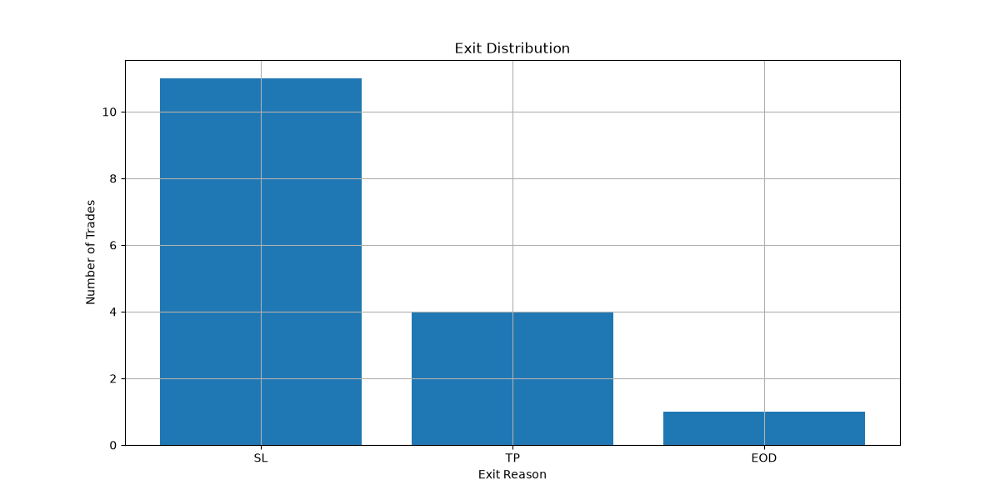
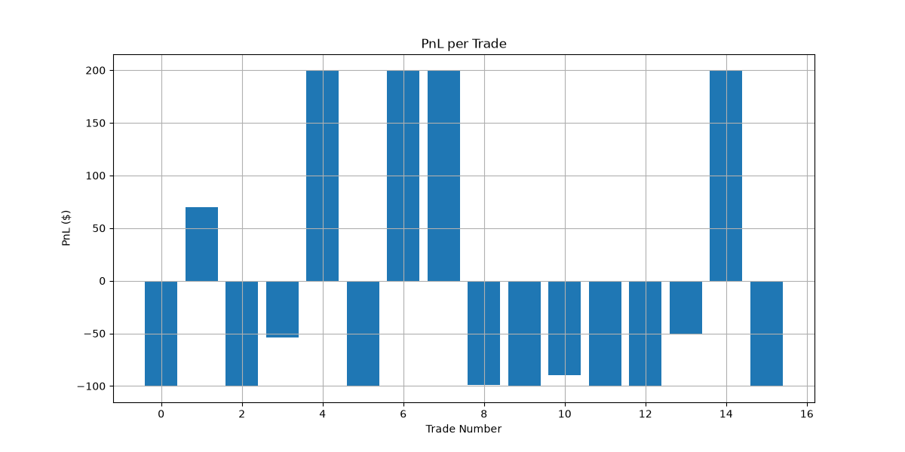
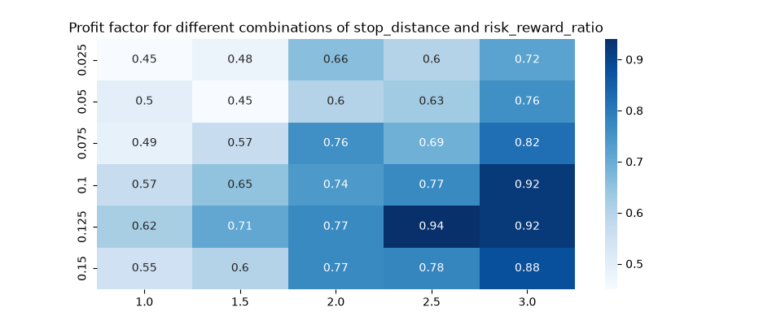

# Python Backtesting Engine

## Description
A pyhton backtesting engine for developing and testing trading strategies on user-provided market data. It is a pipeline that separates loading data (+ preprocessing), introducing indicators, strategy generation, backtesting and statistics. Results are visualised with a separate plotting module. The Main purpose of this project is to improve my python skills while learning quantitative trading and backtesting strategies. The project also includes statistical analysis of strategy performance, including confidence intervals, hypothesis testing, risk-adjusted performance metrics and PnL distribution analysis.

## Project structure

```text
src/
├── data_loader.py
├── indicators.py
├── strategy.py
├── backtester.py
├── performance.py
├── statistics.py
├── distribution.py
├── plots.py
└── main.py
```

```text
experiments/
├── sensitivity_analysis.py
├── 1D_sensitivity.py
├── 2D_sensitivity.py
├── split_data.py
└── out_of_sample.py
```

```text
notebooks/
└── statistical_derivations.ipynb
```

| File | Description |
|------|-------------|
| `data_loader.py` | Downloads data, source can be chosen by the user. Prepares the data for usage. |
| `indicators.py` | Introduces technical indicators that will be used within the strategy. |
| `strategy.py` | Generates trading signals. |
| `backtester.py` | Uses the generated signals to simulate trades. |
| `performance.py` | Calculates key performance statistics from the list of simulated trades. |
| `statistics.py` | Calculates confidence intervals, hypothesis testing, Sharpe, Sortino, Calmar. |
| `distribution.py` | Calculates distribution parameters. |
| `plots.py` | Visualises the obtained results. |
| `main.py` | Runs complete pipeline. |
| `sensitivity_analysis.py` | Sensitivity analysis, metrics and heatmap. |
| `1D_sensitivity.py` | Runs pipeline for 1 parameter. |
| `split_data.py` | Download data and split at a chosen date. |
| `out_of_sample.py` | Backtest on in_sample and out_of_sample data. |

## Installation
```bash
pip install yfinance pandas numpy matplotlib ta
```

## Pipeline
```python
ticker = "AAPL"

# Load data
data = load_yfinance_data(ticker)
daily = load_daily_data(ticker)

start_date = data.index[0]
end_date = data.index[-1]
days = (end_date - start_date).days

# Indicators
data = get_vwap(data)
data = get_ema(data)
data = get_atr(data, daily)
data = get_dayrange(data)

# Strategy
data = crossover_strategy(data)

# Backtest
trades = backtest(data, risk_reward_ratio=2)

# Statistics
performance_metrics = key_statistics(trades)
winrate = win_rate(trades)
ev = expected_value(trades)
ev_reliability = test_expected_value(trades)
sharpe = Sharpe_ratio(trades)
sortino = Sortino_ratio(trades)
calmar = Calmar_ratio(trades, days)
distribution = distribution_statistics(trades)

print("\n========== BACKTEST RESULTS ==========")

print("\nPERFORMANCE")
print(f"Ticker:              {ticker}")
print(f"Trades:              {performance_metrics['Trades']:.0f}")
print(f"Win rate:            {performance_metrics['Winrate']:.2f}%")
print(f"Profit factor:       {performance_metrics['ProfitFactor']:.2f}")
print(f"Total PnL:           {performance_metrics['TotalPnL']:.2f}")
print(f"Average win:         {performance_metrics['AvgWin']:.2f}")
print(f"Average loss:        {performance_metrics['AvgLoss']:.2f}")
print(f"Max drawdown:        {performance_metrics['MaxDrawdown']:.2f}")
print(f"Return / Drawdown:   {performance_metrics['Return/DD']:.2f}")
print(f"Sharpe Ratio:        {sharpe:.2f}")
print(f"Sortino Ratio:       {sortino:.2f}")
print(f"Calmar Ratio:        {calmar:.2f}")
print(performance_metrics["Exits"])
print(performance_metrics["Percentage exits"])

print("\nCONFIDENCE INTERVALS")
print(f"Observed win rate:   {winrate['WinRate']:.2%}")
print(f"Standard error:      {winrate['StandardError']:.4f}")
print(f"95% CI:              {winrate['LowerCI']:.2%}, {winrate['UpperCI']:.2%}")
print(f"Observed EV:         {ev['ExpectedValue']:.2f}")
print(f"Standard error:      {ev['StandardError']:.4f}")
print(f"95% CI:              {ev['LowerCI']:.2f}, {ev['UpperCI']:.2f}")

print("\nEXPECTED VALUE TEST")
print(f"Observed EV:         {ev_reliability['Observed_EV']:.2f}")
print(f"Null hypothesis EV:  {ev_reliability['Null_hypothesis_EV']:.2f}")
print(f"Standard error:      {ev_reliability['StandardError']:.4f}")
print(f"t-score:             {ev_reliability['t_score']:.3f}")
print(f"p-value:             {ev_reliability['p_value']:.4f}")
print(f"Alpha:               {ev_reliability['alpha']:.2f}")

if ev_reliability["Reject_null"]:
    print("Conclusion:          Reject H0")
else:
    print("Conclusion:          Fail to reject H0")

print("\nDISTRIBUTION")
print(f"Median:              {distribution['Median']:.2f}")
print(f"Best trade:          {distribution['Best']:.2f}")
print(f"Worst trade:         {distribution['Worst']:.2f}")
print(f"Skewness:            {distribution['Skewness']:.2f}")
print(f"Kurtosis:            {distribution['Kurtosis']:.2f}")

# Plots
equity_curve(trades)
drawdown_curve(trades)
pnl_per_trade(trades)
distribution_exits(trades)
plot_pnl_distribution(trades)
```

## Strategy
To test the engine, a simple EMA/VWAP crossover strategy was implemented.

### Entry

- EMA crosses over VWAP --> long
- EMA crosses under VWAP --> short
- Timeframe: 09:40 - 10:30 (NY time)
- Entry on next candle open

### Exit

A position is closed when one of the following occurs:

- Stop-loss is reached
- Take-profit is reached
- End of trading day

### Risk managment

- Initial stop-loss is based on the crossover level.
- A minimum stop distance of `0.05 × ATR_daily` is applied to make sure it's not too tight.
- Take-profit is determined using a fixed risk-reward ratio of 2:1.
- The take-profit must remain within the daily ATR boundary.

## Example output
Engine ran on 21/09/2026 11:30 for ticker "AAPL"

output:
```text
========== BACKTEST RESULTS ==========

PERFORMANCE
Ticker:              AAPL
Trades:              16
Win rate:            31.25%
Profit factor:       0.88
Total PnL:           -124.19
Average win:         173.88
Average loss:        -90.33
Max drawdown:        -539.67
Return / Drawdown:   -0.23
Sharpe Ratio:        -0.05
Sortino Ratio:       -0.09
Calmar Ratio:        -1.97
Reason exit
SL     11
TP      4
EOD     1
Name: count, dtype: int64
Reason exit
SL     68.75
TP     25.00
EOD     6.25
Name: proportion, dtype: float64

CONFIDENCE INTERVALS
Observed win rate:   31.25%
Standard error:      0.1159
95% CI:              8.54%, 53.96%
Observed EV:         -7.76
Standard error:      32.7309
95% CI:              -77.53, 62.00

EXPECTED VALUE TEST
Observed EV:         -7.76
Null hypothesis EV:  0.00
Standard error:      32.7309
t-score:             -0.237
p-value:             0.5921
Alpha:               0.05
Conclusion:          Fail to reject H0

DISTRIBUTION
Median:              -94.41
Best trade:          200.10
Worst trade:         -100.44
Skewness:            1.00
Kurtosis:            -0.96
```
example plots:
### Equity Curve


### Drawdown Curve


### PnL Distribution


### Exit Distribution


### PnL per Trade


## Sensitivity Analysis

Pipeline for the 1D sensitivity analysis. Parameters and their range of values are defined within the pipeline.

```python
ticker= "SPY"

data = load_yfinance_data(ticker)
daily = load_daily_data(ticker)

data = get_vwap(data)
data = get_ema(data)
data = get_atr(data, daily)
data = get_dayrange(data)

data = crossover_strategy(data)

parameters = {
    "stop_distance": [0.025, 0.05, 0.075, 0.1, 0.125, 0.15],
    "risk_reward_ratio": [1, 1.5, 2, 2.5, 3],
    "slippage_bps": [1, 2, 3, 4, 5],
    "commission_per_share": [0.002, 0.005, 0.007, 0.01]
}

# Chose parameter for sensitivity analysis
parameter = "stop_distance"
results_df = sensitivity_analysis_1d(data, parameter, parameters[parameter])
print(results_df.to_string(index=False))
```
Pipeline for the 2D sensitivity analysis includes the chosen metric to be evaluated and a heatmap as output.

```python
ticker= "SPY"

data = load_yfinance_data(ticker)
daily = load_daily_data(ticker)

data = get_vwap(data)
data = get_ema(data)
data = get_atr(data, daily)
data = get_dayrange(data)

data = crossover_strategy(data)

parameters = {
    "stop_distance": [0.025, 0.05, 0.075, 0.1, 0.125, 0.15],
    "risk_reward_ratio": [1, 1.5, 2, 2.5, 3],
    "slippage_bps": [1, 2, 3, 4, 5],
    "commission_per_share": [0.002, 0.005, 0.007, 0.01]
}

# Chose parameters and metric to be evaluated
parameter_1 = "stop_distance"
parameter_2 = "risk_reward_ratio"
metric = "Profit factor"

crosstable = sensitivity_analysis_2d(data, parameter_1, parameters[parameter_1], parameter_2, parameters[parameter_2], metric)
print(crosstable.to_string())

heatmap(crosstable, parameter_1, parameter_2, metric)
```

### Example output
Sensitivity analysis ran on 29/09/2026 at 10:45 for ticker "SPY".

output:
```text
        1.0   1.5   2.0   2.5   3.0
0.025  0.45  0.48  0.66  0.60  0.72
0.050  0.50  0.45  0.60  0.63  0.76
0.075  0.49  0.57  0.76  0.69  0.82
0.100  0.57  0.65  0.74  0.77  0.92
0.125  0.62  0.71  0.77  0.94  0.92
0.150  0.55  0.60  0.77  0.78  0.88
```

heatmap


## Out of Sample Analysis

To perform an out of sample analysis first the data is split at a chosen date with function split_data. This function does not perform the backtest yet only generates the in-sample data (is_data) and out-of-sample data (oos_data) based on the strategy. With the sensitivity analysis in-sample data can be studied and optimised. Finally, with the pipeline in out_of_sample.py, in-sample and out-of-sample data are backtested and perfromance metrics/statistics are derived for both data sets. Also thee difference is calculated.

### Example Output
Out of sample analysis performed on 29/09/2026 10:39 for ticker "SPY" with the split at 01/09/2026.

output:
```text
========== IS vs OOS ==========
                In-Sample  Out-of-Sample    diff
Trades              14.00          18.00    4.00
Win rate            21.43          33.33   11.90
Profit factor        0.30           0.59    0.29
Total PnL         -908.58        -563.92  344.66
Avg win            132.18         133.77    1.59
Avg loss          -118.65        -113.88    4.77
Max drawdown      -936.70        -772.59  164.11
Return / DD         -0.97          -0.73    0.24
Expected value     -64.90         -31.33   33.57
Sharpe              -0.60          -0.25    0.34
Sortino             -0.61          -0.33    0.28
Calmar              -9.19          -7.05    2.14
Median PnL        -116.70        -108.17    8.52
Best trade         137.85         139.99    2.15
Worst trade       -127.39        -126.77    0.62
Skewness             1.55           0.77   -0.78
Kurtosis             0.49          -1.58   -2.07
```

## Limitations

Current limitations include:

- Limited historical data
- Fixed transaction costs and slippage
- Limited out-of-sample validation
- Limited number of traded assets
- Statistical tests rely on assumptions that may not fully hold for financial time series

## Future improvements

- Commission and slippage predictive model
- Robustness analysis
- Multiple strategies
- Additional indicators
- News, events and earnings data
- Partial exits
- Trailing stop-loss